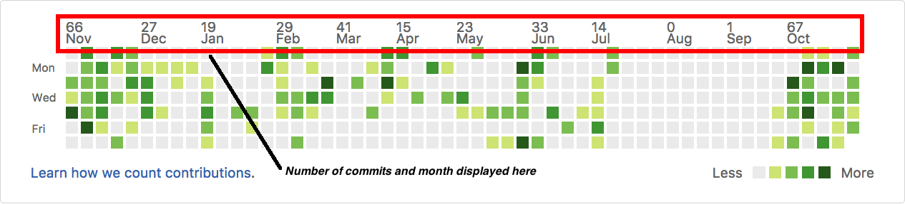

View GitHub Commits
===================

A Google Chrome extension that displays monthly GitHub commits in your contributions graph.

Install
-------
Install it on Google Chrome from [Webstore](https://chrome.google.com/webstore/detail/view-github-commits/cbeaaclmmogoehebfjojkhkcepjecbmd)

NOTE: It this link does not work, you can get the source code from here and install it by following the steps mentioned in Getting Started section.

Getting Started
---------------
Within Google Chrome go to:

- chrome://extensions
- Enable Developer Mode
- Load unpacked extensions
- Test

Author
------
Deep Aggarwal  
deep.uiuc@gmail.com  
Date Started: 11/01/2016  
